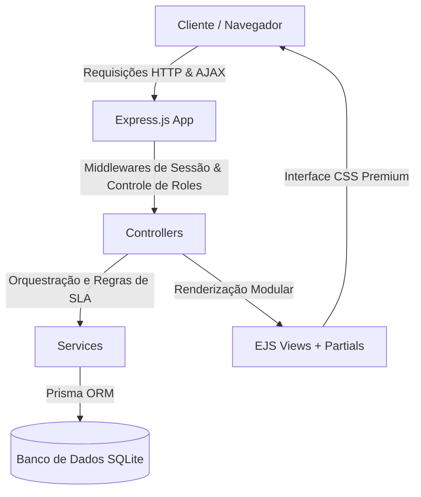
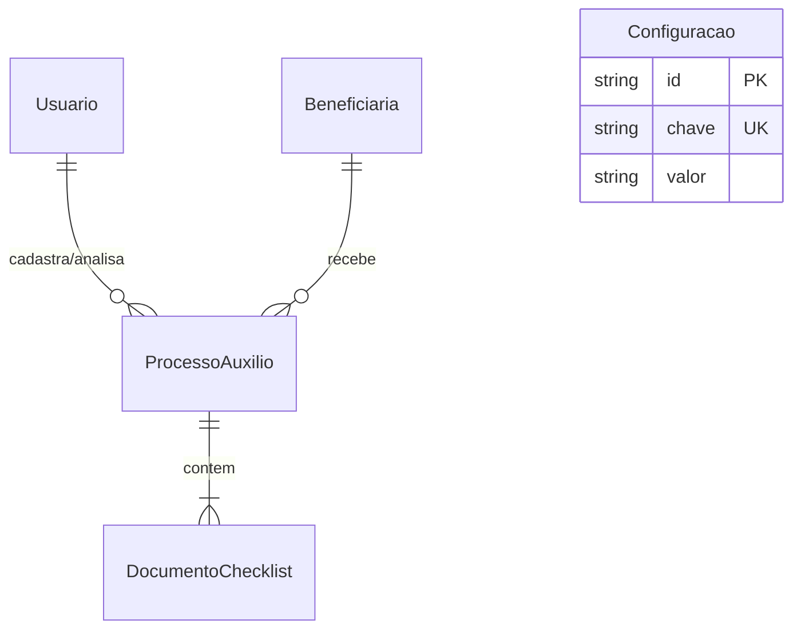
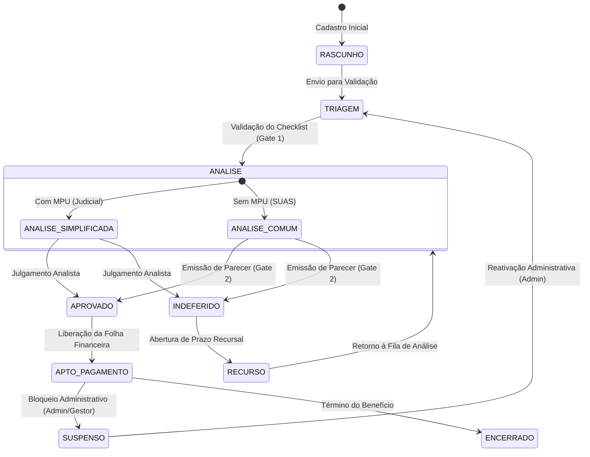

# Relatório de Desenvolvimento de Projeto (RDP)
## Sistema Auxílio Aluguel (MVP)

Este documento constitui o **Relatório de Desenvolvimento de Projeto (RDP)** oficial para o MVP do **Sistema Auxílio Aluguel**. O sistema foi concebido como uma esteira digital completa para tramitação, análise de elegibilidade e aprovação de concessão de benefícios emergenciais e regulares de auxílio moradia, estruturada em conformidade com as diretrizes do Ministério do Desenvolvimento Social (MDS) e do Sistema Único de Assistência Social (SUAS) para o Estado do Rio de Janeiro.

---

## 🗺️ 1. Visão Geral e Escopo de Negócio

O principal propósito do **Sistema Auxílio Aluguel (MVP)** é organizar de forma segura, auditável e ágil o fluxo de concessão de benefícios habitacionais, dividindo a esteira de atendimento em dois caminhos inteligentes com base na vulnerabilidade e urgência jurídica da cidadã:

### 1.1 Objetivos Estratégicos
*   **Esteira Judicial/Simplificada:** Trâmite prioritário com prazo crítico de atendimento para mulheres sob a proteção de **Medida Protetiva de Urgência (MPU)** decorrente de violência doméstica de gênero.
*   **Esteira Comum:** Trâmite assistencial regular sob a supervisão técnica de Assistentes Sociais para famílias em situação de extrema vulnerabilidade social e habitacional.

### 1.2 Restrições de Escopo (Fronteiras do MVP)
De forma a garantir foco absoluto na conformidade processual e economia de recursos, o MVP delimita rigidamente suas fronteiras de atuação:
*   **Sem Pagamentos Internos:** O sistema **não realiza processamento financeiro**, transações ou integração com gateways bancários. Sua função encerra-se na alteração do processo para o status `APTO_PAGAMENTO` e na consolidação de dados na folha para exportação por planilha estruturada (CSV) compatível com sistemas financeiros corporativos externos.
*   **Sem APIs Externas Ativas:** Validações de bancos de dados externos (como CadÚnico ou certidões do TJRJ) são simuladas com base em **entradas manuais auditadas** pelo operador. As tabelas do banco de dados já incluem campos de controle (`ocrProcessado`, `apiOrigemDados`) estruturados para receber integrações futuras de forma transparente.

---

## 🏗️ 2. Arquitetura do Sistema e Stack Tecnológica

O sistema foi arquitetado em um modelo **Modular MPA (Multi-Page Application)** de alta fidelidade e excelente performance.

### 2.1 Stack de Tecnologia
*   **Ambiente de Execução:** Node.js (versão >= 18.0.0).
*   **Framework Web:** Express.js, proporcionando rotas limpas e organizadas.
*   **Motor de Templates:** EJS (Embedded JavaScript), viabilizando componentes reutilizáveis e isolamento lógico.
*   **Modelagem de Dados & Persistência:** Prisma ORM integrado ao banco de dados relacional local SQLite para desenvolvimento. A estrutura está programada inteiramente com chaves primárias baseadas em **UUID**, assegurando compatibilidade imediata de migração para bancos corporativos em nuvem (como PostgreSQL/Supabase).
*   **Autenticação e Sessão:** Gerenciamento seguro através de cookies assinados e `express-session` com criptografia nativa de senhas via `bcryptjs`.
*   **Interface Visual:** Vanilla CSS e Tailwind CSS para design de alta fidelidade corporativo com foco em legibilidade e acessibilidade.

---

## 🗃️ 3. Modelo de Dados (Schema Relacional)

O banco de dados foi mapeado via Prisma Schema de modo a refletir a integridade referencial exigida por órgãos reguladores.

### 3.1 Modelos de Entidade
1.  **`Usuario`:** Contas de operadores e gestores do sistema. Armazena dados de acesso e a função funcional (`role`).
2.  **`Configuracao`:** Chaves de controle do sistema parametrizáveis administrativamente (como o valor base mensal do auxílio).
3.  **`Beneficiaria`:** Cadastro completo de informações sociodemográficas e dados bancários criptografados em formato JSON texto.
4.  **`ProcessoAuxilio`:** Documentação do processo SEI. Armazena a esteira, status do workflow, datas regulamentares, prazos limite de análise, laudos sociais e pareceres técnicos descritivos.
5.  **`DocumentoChecklist`:** Mapeamento de documentos digitados e armazenados (RG, CPF, Comprovante de Residência, MPU, Folha do CadÚnico) com sinalizações de verificação manual e OCR.

---

## 👥 4. Matriz de Roles (Perfis) e Controle de Acesso

O sistema dispõe de controle estrito de rotas e interfaces baseadas nas responsabilidades legais de cada usuário operador:

| Perfil | Nível de Acesso | Responsabilidade Principal | Ação Crucial no Workflow |
| :--- | :--- | :--- | :--- |
| **`ADMIN`** | Global (Escrita/Override) | Configuração de parâmetros e auditoria de usuários. | Cadastra operadores, altera o valor base do benefício e realiza overrides de processos (suspensão/reativação). |
| **`OPERADOR_ENTRADA`** | Inserção & Triagem | Acolhimento e cadastro inicial das cidadãs. | Preenche formulários, faz upload e confere checklists de documentos, tramitando da Triagem para Análise. |
| **`ANALISTA_SEDSODH`** | Aprovação / Julgamento | Avaliação e deferimento na esteira Judicial. | Analisa processos prioritários com MPU, podendo Deferir, Indeferir ou iniciar análise. Lockout de escrita em processos comuns. |
| **`ASSISTENTE_SOCIAL_SUAS`** | Parecer Técnico | Análise social de campo na esteira Comum. | Emite laudos técnicos descritivos obrigatórios, pareceres sociais e valida o avanço de processos regulares. |
| **`GESTOR_SEMPI`** | Leitura Exclusiva | Inteligência estratégica e monitoramento. | Audita a esteira através de métricas executivas, monitora gargalos de SLA e exporta a folha de pagamentos para CSV. |

---

## ⚙️ 5. Máquina de Estados e Engenharia de Workflow

O core da esteira operacional é governado por uma máquina de estados segura e livre de inconsistências no backend:

### 5.1 Regras de Trava e Gates de Segurança (Prazos de SLA)
*   **Gate 1 - Trava de Checklist Completo:** Um processo em estado de `TRIAGEM` só poderá avançar para a fase de `ANALISE` se o operador validar individualmente a conformidade de todos os documentos obrigatórios no checklist da interface.
*   **Gate 2 - Trava de Parecer Social SUAS:** Na esteira Comum, o botão de aprovação é terminantemente bloqueado no backend e frontend até que o Assistente Social do SUAS preencha formalmente o **Parecer Social** e o **Relatório Técnico Descritivo** da beneficiária.
*   **Cálculo Dinâmico de Prazos Legais (SLA):**
    *   **Esteira Judicial (Simplificada):** SLA de **72 horas corridas**. O tempo é contado em horas e minutos de forma ininterrupta.
    *   **Esteira Comum:** SLA de **15 dias úteis**. O backend calcula a data limite saltando finais de semana (Sábados e Domingos).

---

## 🎨 6. Recursos Premium de UI/UX e Acessibilidade Visual

Desenvolvido para emular sistemas corporativos de alto padrão, o visual incorpora as cores do SUAS/MDS aliadas a recursos de interação refinada:

### 6.1 Identidade Visual e Ergonomia
*   **Cores Institucionais:** Azul Confiável (#1E3A8A) transmitindo seriedade, Laranja Social (#F97316) para acolhimento e fundos off-white suaves (#F8FAFC) que reduzem a fadiga visual dos servidores que utilizam o sistema ao longo do dia.
*   **Efeito Glassmorphism na Autenticação:** A página de login foi recriada sob um padrão moderno translúcido e reflexivo de vidro, suportado por orbs flutuantes animados que criam uma primeira impressão institucional de excelência.
*   **Sigilo Visual Centralizado (LGPD / Segurança de Gênero):** Visando proteger a integridade de mulheres abrigadas ou sob perigo físico, dados confidenciais (Nome completo, CPF, NIS, Contatos) são exibidos sob um **filtro de desfoque (blur)** nativo controlado por botão de alternância rápida de sigilo. A lógica de revelação foi unificada globalmente no rodapé do sistema (`footer.ejs`), evitando duplicações no cliente e garantindo performance instantânea.

### 6.2 Componentes e Interações de Alto Nível
*   **Gavetas Laterais Premium (Slide-over Drawers):** Presentes em todas as filas de trabalho. Ao clicar em um processo, uma gaveta lateral elástica surge sem recarregar a tela, exibindo o prontuário completo, dados bancários em um mockup translúcido de cartão financeiro corporativo, checklists de documentos e formulários contextuais de pareceres.
*   **Gráficos Estatísticos Nativos:** Renderizados puramente em CSS e integrados de forma reativa aos dados coletados do Prisma. O uso de CDNs ou bibliotecas externas pesadas de renderização foi descartado, resultando em carregamentos instantâneos.
*   **Paginação Inteligente e Filtro Unificado:** Componente de rodapé com navegação rápida ("Ant." e "Próx.") e limitadores dinâmicos de listagem (5, 10 ou 15 itens por página). Integrada reativamente ao filtro de busca em tempo real e às abas de categorias.

---

## 📈 7. Auditoria Operacional e Dashboards Gerenciais

O sistema foi enriquecido com recursos de supervisão operacional e controle administrativo descentralizado:

### 7.1 Painel Analítico do Gestor (SEMPI)
Dividido em **4 abas estratégicas** de alto impacto para a tomada de decisões corporativas:
1.  **Resumo Estratégico:** Apresenta notas de governança, métricas e alertas sobre o acúmulo de processos pendentes na esteira.
2.  **Territórios e Perfil:** Gráficos interativos apresentando a distribuição geográfica das assistidas (bairros), evolução de novos ingressos por mês, demografia etária e proporção do uso de esteiras.
3.  **Fila Financeira:** Histórico consolidado de folha corrente (soma do benefício unitário multiplicado pelo valor base parametrizado) com exportação imediata em planilha CSV.
4.  **Gargalos & SLA:** Painel analítico exibindo quais processos correm risco iminente de atraso, alertando os diretores por badges de pulso visual em vermelho para itens vencidos.

### 7.2 Painel Administrativo de Override (ADMIN)
Estruturado em **3 abas técnicas** focadas no controle operacional da esteira:
1.  **Controle Geral de Processos:** Visualização unificada de todas as solicitações, com gaveta lateral liberando comandos de intervenção de segurança (`Suspender Benefício`, `Reativar/Retornar à Triagem` e `Arquivar`).
2.  **Gestão de Operadores:** Grade estilizada de cartões de perfil dos colaboradores ativos, exibindo avatares circulares com as iniciais do funcionário e badges com as cores específicas de sua permissão, acompanhado de painel para criar ou deletar credenciais.
3.  **Parâmetros do Sistema:** Formulário simplificado para atualizar o **Valor Base do Benefício** do programa habitacional em tempo real.

---

## 🧪 8. Garantia de Qualidade e Validação

De forma a atestar a segurança e robustez do sistema antes de sua disponibilização em ambiente de homologação, foram conduzidos dois grandes mecanismos de teste:

### 8.1 Massa de Dados com 15 Registros Complexos
O banco de dados do MVP foi semeado com **15 requerimentos fictícios ricos em detalhes**, permitindo validar todos os cenários limites do sistema:
*   Processos com prazos de SLA estourados exibindo badges de atraso vermelhas vibrantes (Exemplo: registro de `Rita Lee`).
*   Registros concluídos com parecer social ausente para certificar o funcionamento do desbloqueio condicional de escrita para assistentes sociais (Exemplo: registros de `Tarsila do Amaral` e `Lygia Clark`).
*   Distribuição balanceada de processos ativos, indeferidos, em recurso ou finalizados em todas as áreas territoriais.

### 8.2 Testes de Compilação Automatizados
Foi desenvolvido um script dedicado de renderização (`scratch/test_templates.js`) que compila programaticamente as views EJS simulando todas as sessões, roles e arrays de dados possíveis do banco de dados, garantindo que o sistema execute em produção com **zero warnings ou falhas de renderização**.

---

## 📈 9. Conclusão e Próximos Passos (Roadmap Pós-MVP)

O **Sistema Auxílio Aluguel (MVP)** cumpre com excelência todos os requisitos estruturais e de UX definidos em seu escopo de negócios, entregando uma ferramenta operacional premium para a tramitação de políticas públicas.

Com a arquitetura moderna de isolamento em camadas de serviços e banco de dados preparado para nuvem, os próximos passos planejados na esteira do projeto incluem:
1.  **Integração do OCR (MDS):** Leitura de dados automáticos de documentos anexados nas gavetas de triagem.
2.  **Ativação das APIs Externas:** Conexão com os bancos de dados do Cadastro Único e sistemas processuais do Tribunal de Justiça do Rio de Janeiro.
3.  **Mecanismo de Logs de Auditoria:** Registro detalhado no banco de dados de todas as ações de override tomadas por administradores nos processos.
